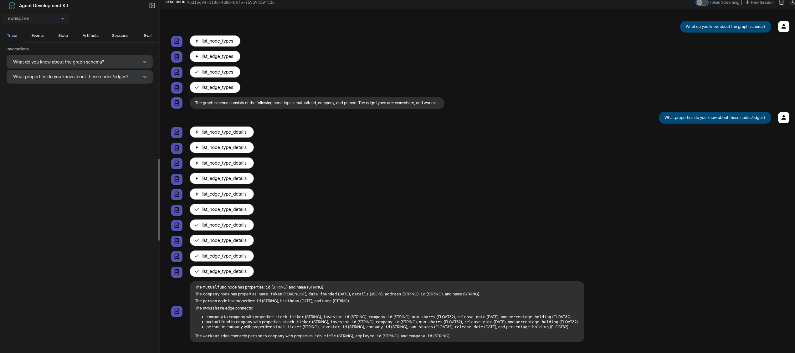
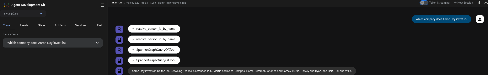
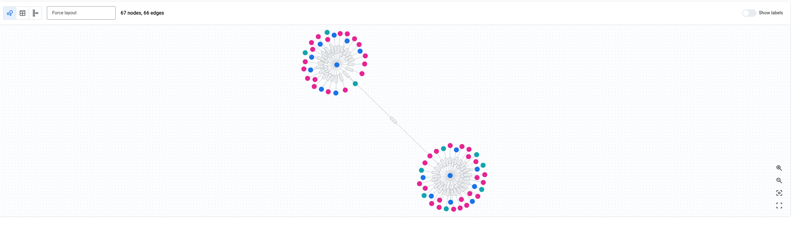

# spanner-graph-agent

## Quick start

Start with the [example](example/) directory by
[initializing the environment](examples#run-the-agent-with-adk) and run `adk
web` to start the adk browser and select the `examples` directory to use the
example agent.

To bootstrap a sample database, go to the
[sample finance dataset](datasets/finance) and run bootstrap code to populate
the sample data.

## Inspect Spanner Graph schema

## Query Spanner Graph

## Visualize Spanner Graph

